# Engineering Team Directory

Welcome to the Engineering Team Directory lab. In this activity, each participant adds an engineer profile through a real fork, branch, pull request, automated validation, review, and deployment workflow.

## What you will learn

By completing the activity, you will practice:

- Forking and cloning a GitHub repository
- Authenticating GitHub CLI
- Creating a Git branch
- Staging, committing, and pushing a change
- Opening a pull request from a fork
- Reading GitHub Actions checks
- Participating in review and merge workflows
- Verifying a GitHub Pages deployment

## Before you begin

Install the following tools:

- [Git](https://git-scm.com/downloads)
- [Visual Studio Code](https://code.visualstudio.com/)
- [GitHub CLI](https://cli.github.com/)
- [Node.js 22 or newer](https://nodejs.org/)

You also need a GitHub account. Use the same account throughout the activity.

## 1. Fork the repository

1. Open the [original Engineering Team Directory repository](https://github.com/sakshamgupta912-ms/engineering-team-directory).
2. Select **Fork**.
3. Choose your GitHub account as the owner.
4. Keep **Copy the `main` branch only** selected.
5. Select **Create fork**.

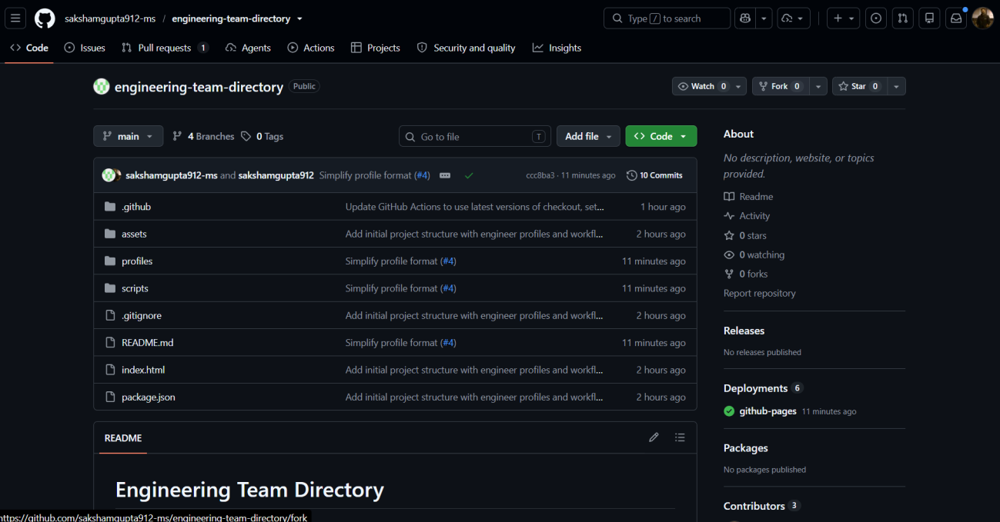

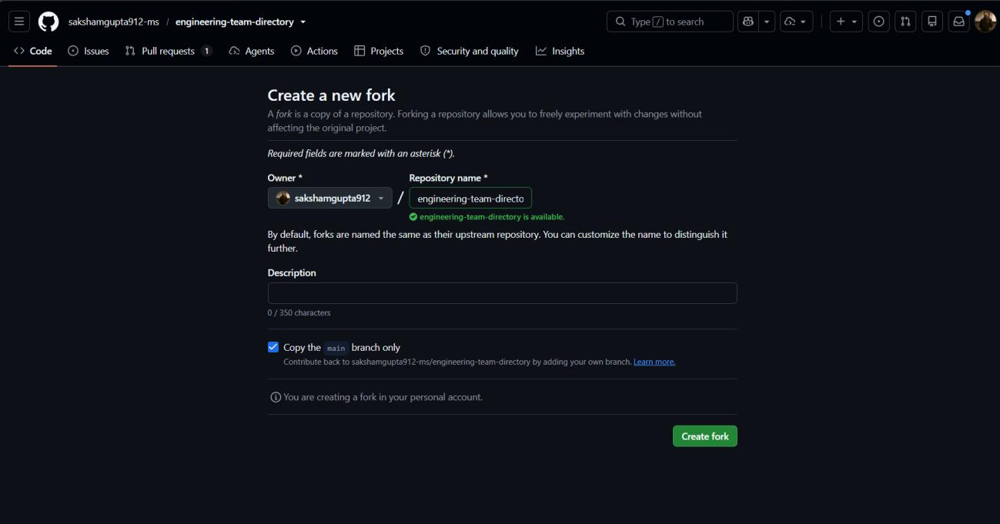

After GitHub creates the fork, confirm that the repository is under your account:

```text
https://github.com/YOUR-GITHUB-USERNAME/engineering-team-directory
```

Do not clone the original `sakshamgupta912-ms` repository. You will push your branch to your fork and submit it back to the original repository through a pull request.

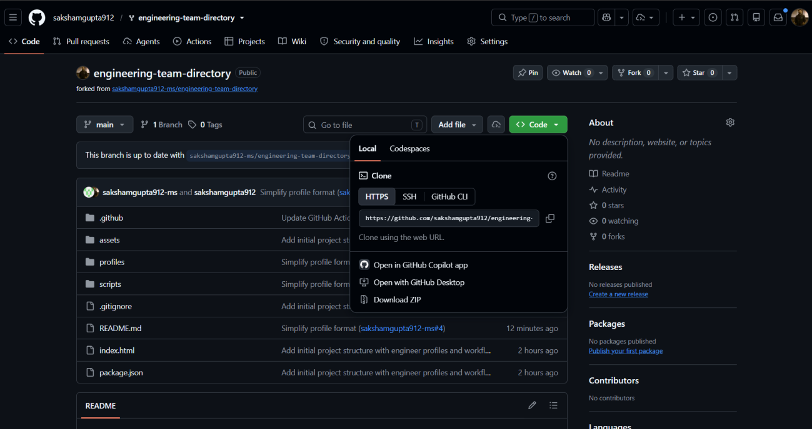

## 2. Authenticate GitHub CLI

Open a new folder in Visual Studio Code, open the integrated terminal, and run:

```powershell
gh auth login
```

Choose these options when prompted:

1. **GitHub.com**
2. **HTTPS**
3. **Authenticate Git with your GitHub credentials**
4. **Login with a web browser**

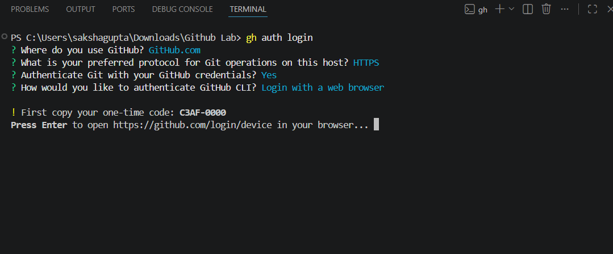

Copy the one-time code shown in the terminal, press Enter to open the browser, and enter the code. Sign in with the same account that owns your fork and authorize GitHub CLI.

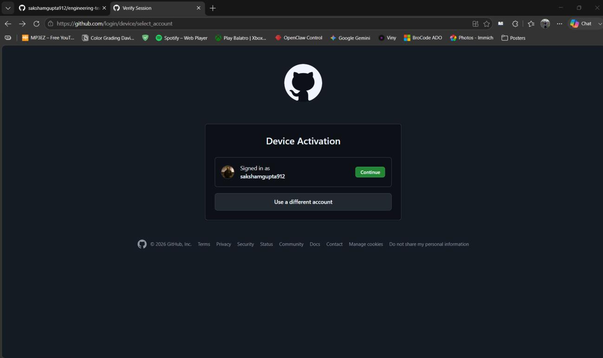

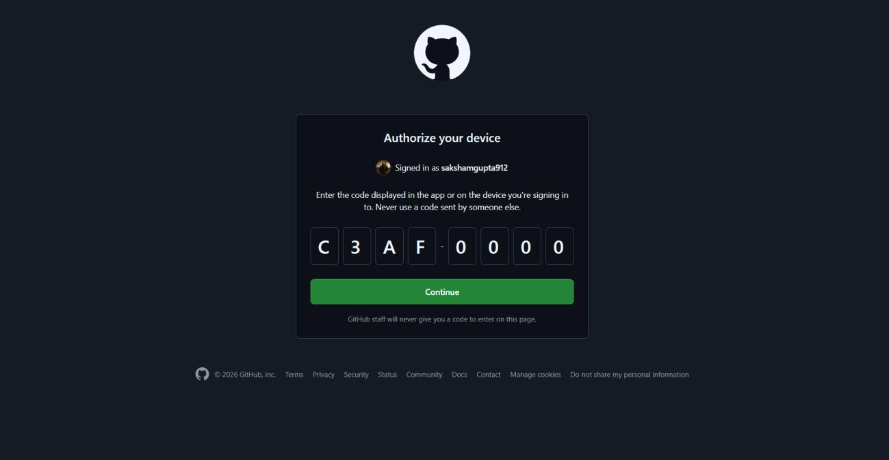

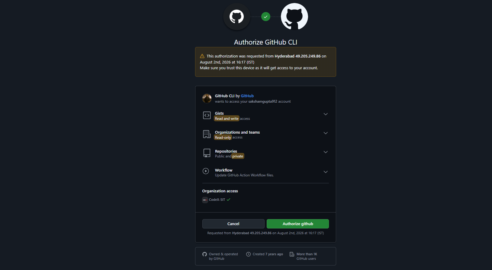

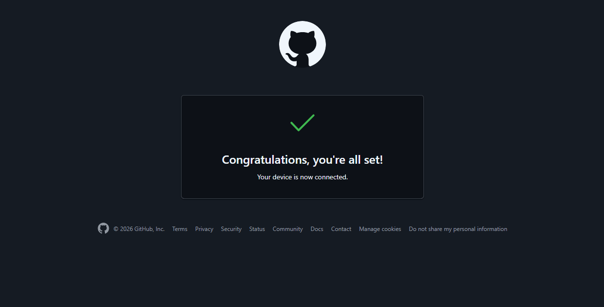

Confirm the login:

```powershell
gh auth status
```

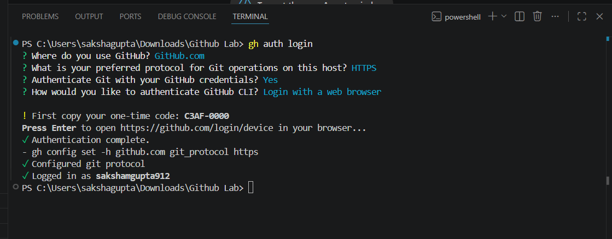

## 3. Clone your fork

Replace `YOUR-GITHUB-USERNAME` with your GitHub username:

```powershell
gh repo clone YOUR-GITHUB-USERNAME/engineering-team-directory
cd .\engineering-team-directory\
```

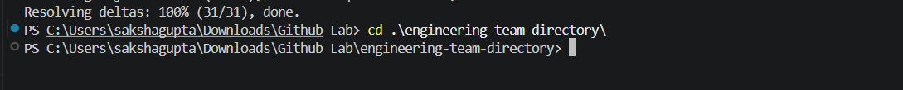

The `origin` remote should point to your fork. Verify it with:

```powershell
git remote -v
```

## 4. Create your profile branch

Create a branch whose name contains your GitHub username:

```powershell
git switch -c profile/YOUR-GITHUB-USERNAME
```

For example:

```powershell
git switch -c profile/sakshamgupta912
```

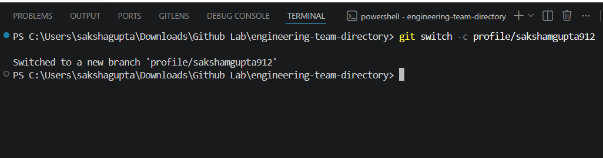

## 5. Add your engineer profile

In Visual Studio Code:

1. Open the `profiles` folder.
2. Duplicate `profiles/sample.md`.
3. Rename the copy to `profiles/YOUR-GITHUB-USERNAME.md`.
4. Replace every sample value with your own information.

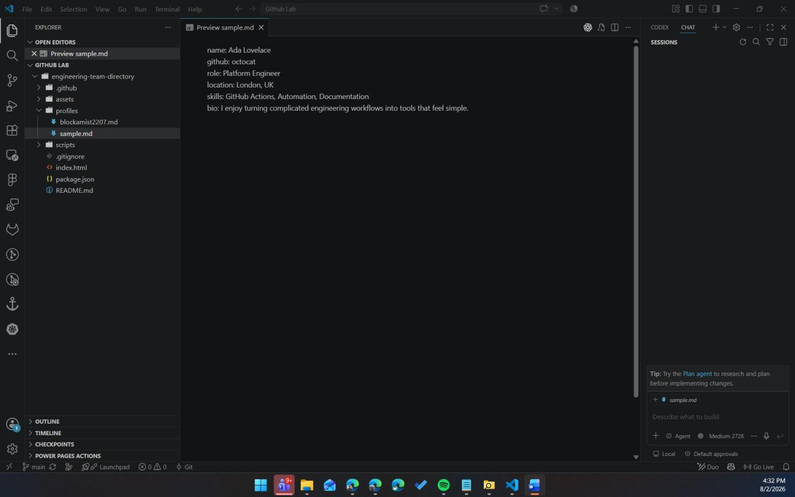

Use this exact field structure:

```markdown
name: Your Name
github: your-github-username
role: Your Role
location: City, Country
skills: Skill One, Skill Two, Skill Three
bio: Write a short introduction about yourself here.
```

The required fields are `name`, `github`, `role`, `location`, `skills`, and `bio`. Keep each field on its own line and separate skills with commas.

Your filename and `github` value must match. For example, the GitHub username `octocat` must use:

```text
profiles/octocat.md
github: octocat
```

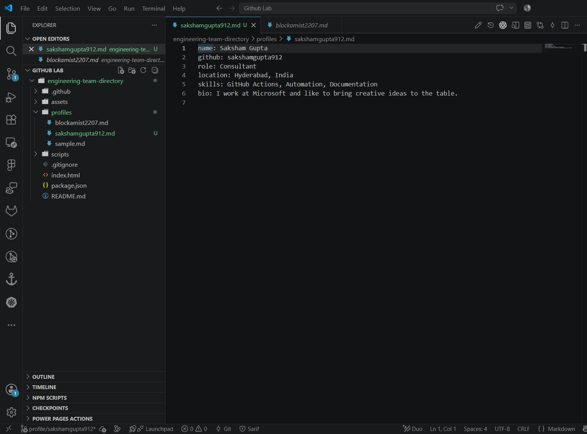

## 6. Validate your profile locally

Run the same validation that the pull request check will use:

```powershell
npm test
```

No `npm install` is required because the project has no external packages. A successful result looks similar to:

```text
Validated and built 3 profile(s).
```

If validation fails, read the error, correct your profile, and run `npm test` again.

You can also open `index.html` in a browser to preview the directory locally after the test generates `assets/profiles-data.js`.

## 7. Commit and push your change

Replace the placeholders in these commands:

```powershell
git add profiles/YOUR-GITHUB-USERNAME.md
git commit -m "Add YOUR-NAME to engineering directory"
git push -u origin profile/YOUR-GITHUB-USERNAME
```

If Visual Studio Code asks you to select a GitHub account, choose the account that owns your fork.

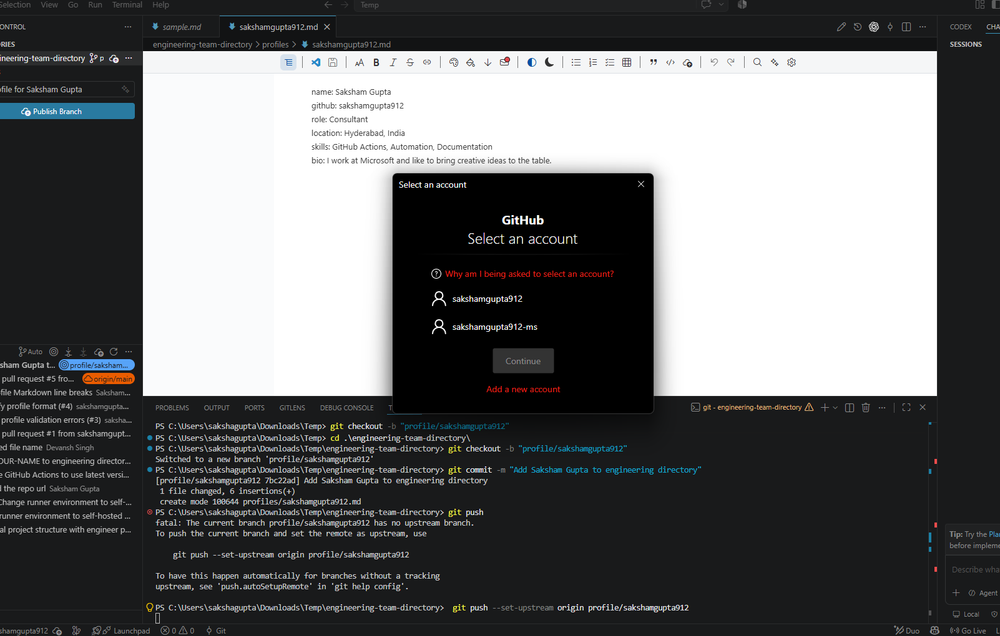

## 8. Open a pull request

1. Open your fork on GitHub.
2. Switch to `profile/YOUR-GITHUB-USERNAME`.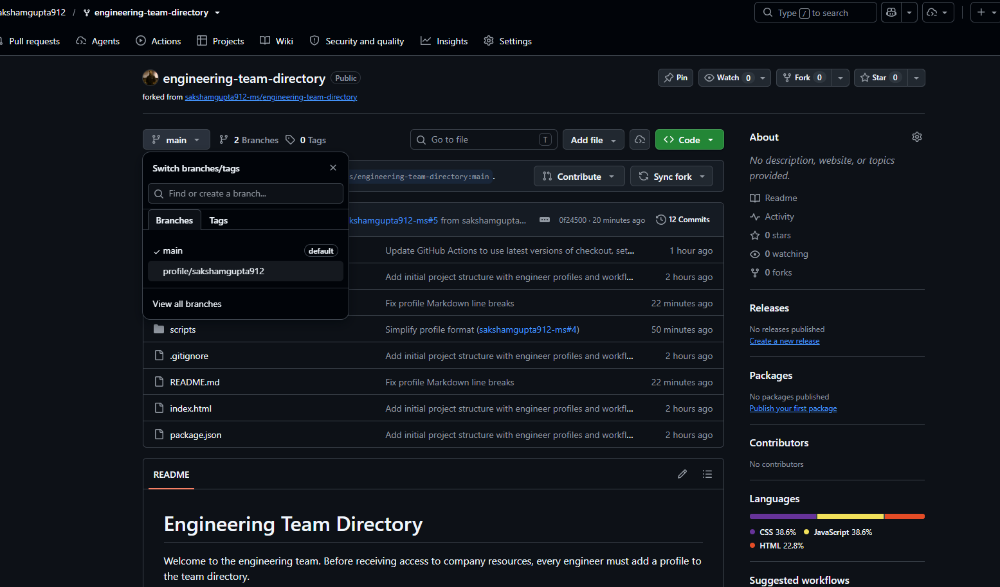
3. Select **Contribute**, then **Open pull request**.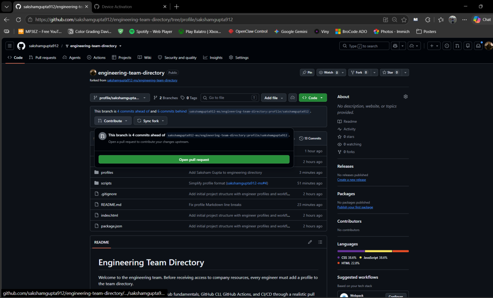
4. Confirm the pull request settings:

| Setting         | Value                                               |
| --------------- | --------------------------------------------------- |
| Base repository | `sakshamgupta912-ms/engineering-team-directory`   |
| Base branch     | `main`                                            |
| Head repository | `YOUR-GITHUB-USERNAME/engineering-team-directory` |
| Compare branch  | `profile/YOUR-GITHUB-USERNAME`                    |

Review the changed files. Your pull request should change only your profile file.

Complete the checklist in the pull request description, add a short introduction, and select **Create pull request**.

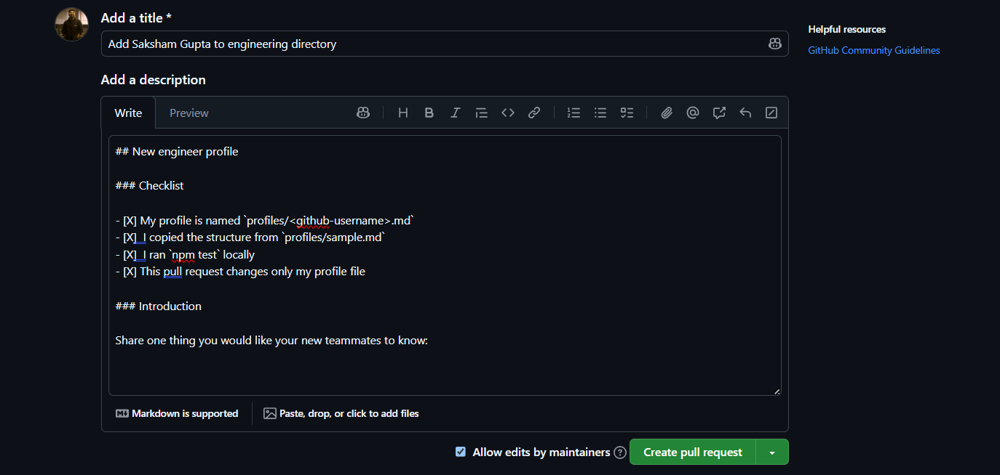

Before submitting, confirm that the diff contains only your profile:

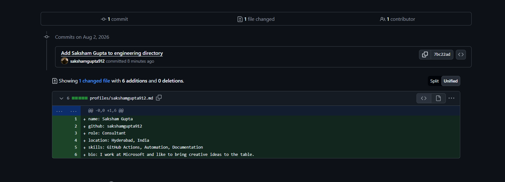

You can also create the cross-fork pull request with GitHub CLI:

```powershell
gh pr create --repo sakshamgupta912-ms/engineering-team-directory --base main --head YOUR-GITHUB-USERNAME:profile/YOUR-GITHUB-USERNAME --fill
```

## 9. Wait for validation and review

GitHub Actions automatically runs the **Validate profiles** check. It verifies that:

- Every required field has a value
- The GitHub username is valid
- The filename matches the GitHub username
- No GitHub username appears more than once

You can monitor the check from the pull request or with:

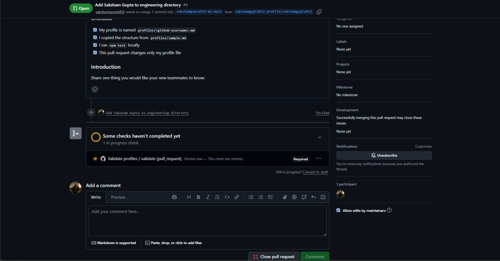

```powershell
gh pr checks --watch
```

If the check fails:

1. Open the failed check and read its error message.
2. Fix the same profile file on your local branch.
3. Run `npm test` again.
4. Commit and push the correction.

The existing pull request updates automatically after each push. Do not open another pull request.

When validation succeeds, the pull request displays **All checks have passed**:

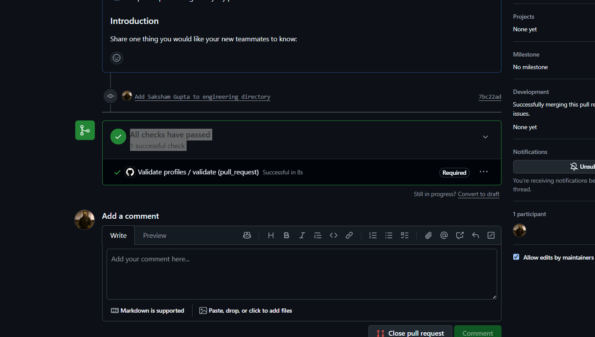

When all checks pass, ask the repository administrator to review and merge your pull request.

## 10. Verify deployment

Merging a profile into `main` starts the **Deploy directory** workflow.

1. Open the repository's [GitHub Actions runs](https://github.com/sakshamgupta912-ms/engineering-team-directory/actions).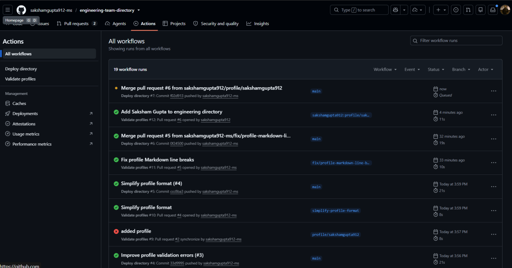
2. Open the workflow run created by the merge.
3. Wait for the deployment job to complete successfully.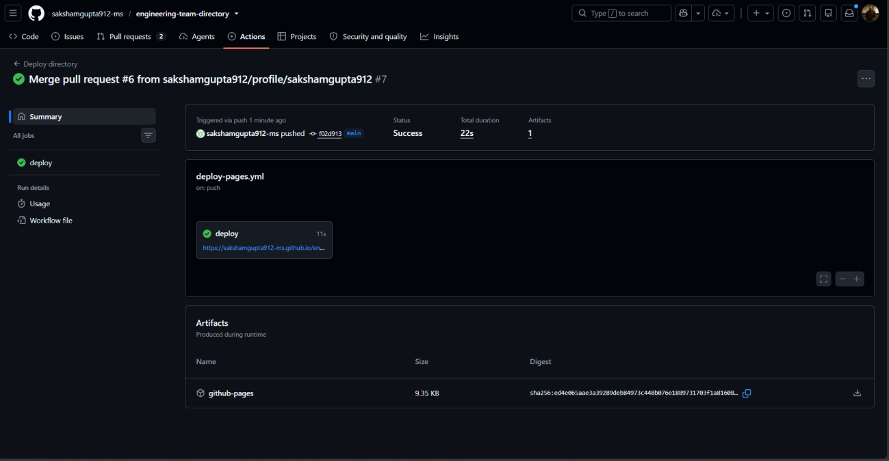
4. Open the [published Engineering Team Directory](https://sakshamgupta912-ms.github.io/engineering-team-directory/).
5. Search for your name or GitHub username and confirm that your profile appears.

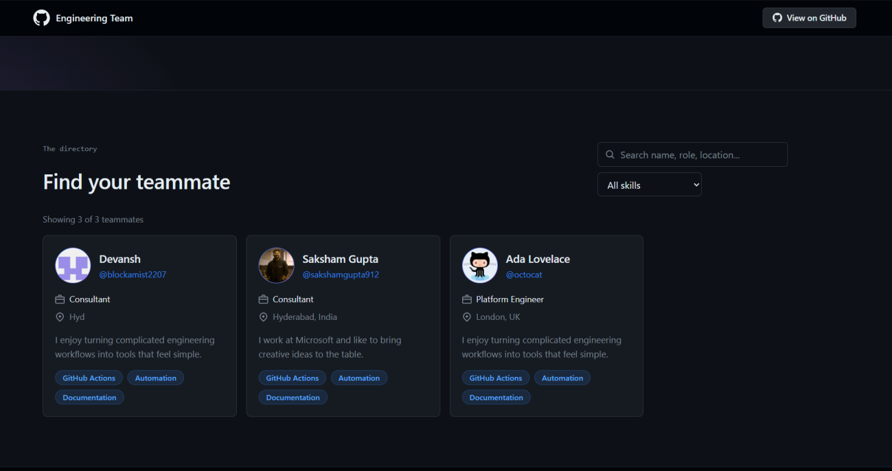

## How the automation works

- **Pull request validation:** `.github/workflows/validate-profiles.yml` runs `npm test` for profile-related pull requests.
- **Profile build:** `scripts/build-profiles.js` validates all Markdown profiles and generates `assets/profiles-data.js`.
- **Website:** `index.html` and the files in `assets` render a searchable, filterable team directory.
- **Deployment:** `.github/workflows/deploy-pages.yml` rebuilds the profile data and publishes the repository through GitHub Pages after a change reaches `main`.

`assets/profiles-data.js` is generated locally and in GitHub Actions, so it is not committed.

## Common problems

### `gh` is not recognized

Install [GitHub CLI](https://cli.github.com/), restart the terminal, and run `gh auth login` again.

### Permission denied while pushing

Check that `origin` points to your fork, not the original repository:

```powershell
git remote -v
```

Also confirm that GitHub CLI is signed in to the account that owns the fork:

```powershell
gh auth status
```

### The profile check fails

Run `npm test` locally and follow the displayed correction. Check all required fields and ensure the profile filename exactly matches the `github` value.

### The pull request contains unrelated files

The activity expects only `profiles/YOUR-GITHUB-USERNAME.md` to change. Review the **Files changed** tab before requesting review.

### The profile is not visible on the website

Confirm that the pull request was merged and that the subsequent **Deploy directory** workflow completed successfully. A profile does not reach the published site while its pull request is still open.

## Instructor setup

1. Enable GitHub Pages with **GitHub Actions** as the source.
2. Protect `main` and require a pull request before merging.
3. Require the `validate` status check.
4. Ask participants to fork the repository; they do not need write access to the original repository.
5. Review and merge profile pull requests after validation passes.
6. For larger groups, assign review pairs so participants also practice pull request review.

## Repository structure

```text
.
|-- .github/
|   |-- pull_request_template.md
|   `-- workflows/
|-- assets/
|   |-- app.js
|   `-- styles.css
|-- profiles/
|   `-- sample.md
|-- scripts/
|   `-- build-profiles.js
|-- index.html
|-- package.json
`-- README.md
```
